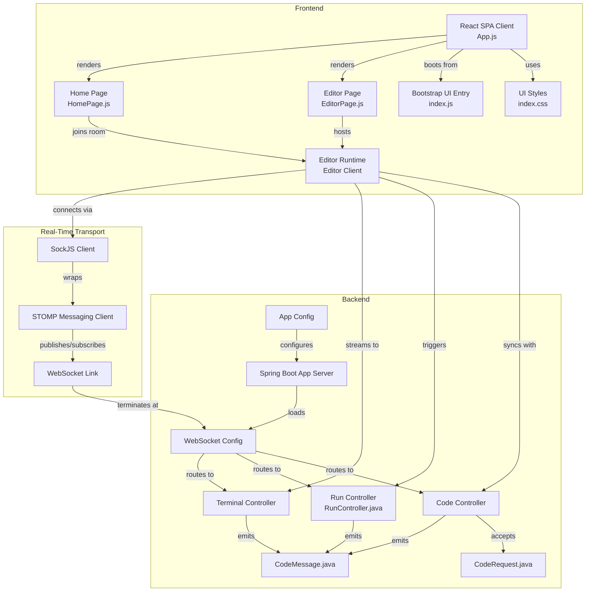

# 🚀 Codera — Real-Time Collaborative Code Editor 


Codera is a full-stack real-time collaborative coding platform where multiple users can join shared rooms and edit code together instantly.

It is built using WebSockets for live synchronization and features a modern Monaco-based code editor similar to VS Code.

---

## ✨ Features

* 🔴 Real-time code synchronization
* 👥 Multi-user collaboration (room-based)
* 🔗 Shareable room links
* 👀 Live user presence tracking
* ⌨️ Typing indicator
* 🎨 Monaco Editor (VS Code-like experience)

---

## 🧠 Tech Stack

### Frontend

* React
* Monaco Editor
* STOMP over WebSocket
* SockJS

### Backend

* Spring Boot
* WebSocket (STOMP protocol)

---

## 📁 Project Structure

```
codera/
├── backend/   # Spring Boot WebSocket server
├── frontend/  # React + Monaco Editor client
```

---

## ⚙️ Setup Instructions

### 1️⃣ Clone Repository

```
git clone https://github.com/njansanjay/Codera-Real-Time-Code-Editor.git
cd codera
```

---

### 2️⃣ Run Backend

```
cd backend
.\mvnw spring-boot:run
```

Backend runs on:

```
http://localhost:8080
```

---

### 3️⃣ Run Frontend

Open new terminal:

```
cd frontend
npm install
npm start
```

Frontend runs on:

```
http://localhost:3000
```

---

## 🧪 Usage

1. Open:

```
http://localhost:3000/
```
* Create a room
* Send the room id to your friend
* Code Together


---

## ⚠️ Limitations

* No conflict resolution (last write wins)
* Still no authentication system(will be resolved later)
* In-memory user tracking (not scalable)

---

## 🚀 Future Improvements

* 🔐 Authentication (JWT)
* 🧠 Conflict resolution (CRDT / OT)
* ☁️ Deployment (cloud hosting)
* 📡 Redis for scaling WebSocket sessions
* ▶️ Code execution feature

---

## 📸 Preview

Available once the project is done

---

## Project Map



---

## 🧑‍💻 Author

Sanjay

---

## 📄 License

This project is open-source and available under the MIT License.
